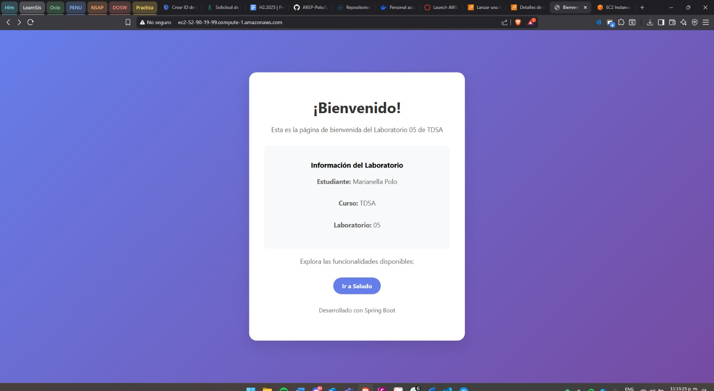

# Laboratorio 05 - AREP (Arquitecturas Empresariales)

**Estudiante:** Marianella Polo Peña

## Descripción

Este laboratorio consiste en crear una aplicación Spring Boot simple con las siguientes características:

- Endpoint `/greeting` que retorna un saludo
- Containerización usando Docker
- Orquestación con Docker Compose
- Publicación de la imagen en DockerHub
- Despliegue en una instancia de Amazon EC2

## Estructura del Proyecto

```
lab-05/
├── src/
│   ├── main/
│   │   ├── java/
│   │   │   └── lab_05/
│   │   │       ├── Lab05Application.java
│   │   │       └── controllers/
│   │   │           └── Controller.java
│   │   └── resources/
│   │       └── application.properties
│   └── test/
├── Dockerfile
├── docker-compose.yml
├── pom.xml
└── README.md
```

## Funcionalidades

### Endpoint Principal
- **GET /greeting**: Retorna un mensaje de saludo

## Tecnologías Utilizadas

- Java 21
- Spring Boot 3.5.6
- Maven
- Docker
- Docker Compose
- Amazon EC2

## Instrucciones de Ejecución

### Ejecución Local
```bash
mvn spring-boot:run
```

### Construcción y Ejecución con Docker
```bash
# Construir la imagen
docker build -t lab05-app .

# Ejecutar con Docker Compose
docker-compose up
```

### Publicación en DockerHub
```bash
# Tag de la imagen
docker tag lab05-app nella1414/lab05arep:latest

# Push a DockerHub
docker push nella1414/lab05arep:latest
```

## Despliegue en EC2

La aplicación fue desplegada exitosamente en una instancia de Amazon EC2. A continuación se muestran las pruebas de funcionamiento:



## Autor

**Marianella Polo Peña**  
Arquitecturas Empresariales (AREP)  
Laboratorio 05